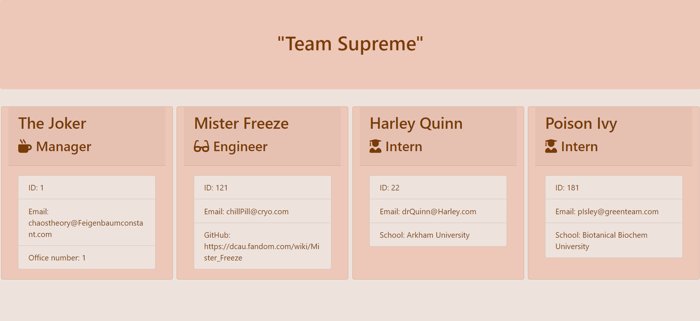

# TeamSupreme

A coding team generator that renders a nice html page with team members and their basic information.

-[Project Link ](https://ewager1.github.io/TeamSupreme/)

g

## Goal

To create a webpage that displays a team's basic info
with quick access to information.

## Description:

- Using the CLI in Node, answer a series of questions about the team to recieve an html page!

## Installation

- have node js
- in command line, npm install jest
- in comman line, npm install inquirer

## Usage

- To run program, type node app.js, then answer the questions presented. You may add as many team members as you wish.
- Once you answer no more team members, the program will automatically generate html in the output folder. it will be called team.html.
- Be aware that running the program again will overwrite the current team.html, so rememeber to save it somewhere else first!

## My Info

-[My Github ](https://github.com/Ewager1)

-[My Portfolio](https://ewager1.github.io/Portfolio/)
